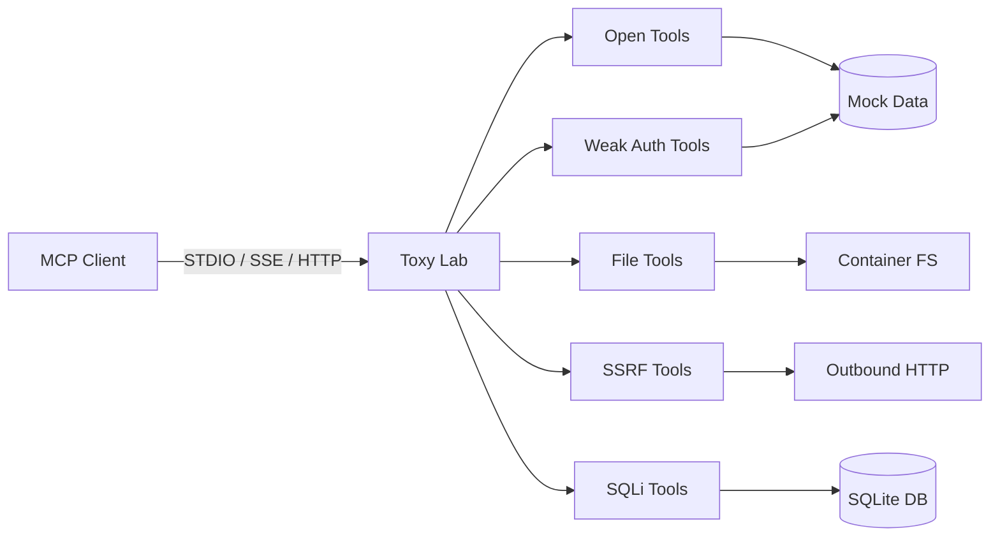

<p align="center">
  <strong>Toxy Insecure MCP Lab</strong><br>
  <sub>Break things on purpose. Learn MCP security by doing.</sub>
</p>

<p align="center">
  <a href="https://www.python.org/"></a>
  <a href="https://modelcontextprotocol.io/"></a>
  <a href="https://docs.docker.com/compose/"></a>
  <a href="https://github.com/toxicaj/vuln_mcp_server"></a>
</p>

---

## ⚠️ Read this first

| Rule | Detail |
|------|--------|
| **Purpose** | Offline classrooms, CTF prep, and authorized security research |
| **Forbidden** | Production, staging, shared hosting, or any internet-facing deployment |
| **Expectation** | Every weakness here is intentional — do not treat this as a template |

---

## Overview

Modern AI agents call external **MCP tools** the same way apps call APIs. When those tools skip authentication, trust user input, or run with too much power, attackers inherit that access.

**Toxy Insecure MCP Lab** models those failures in a single Python service you can drive from any MCP client, `curl`, or the MCP Inspector.



---

## Lab snapshot

| Item | Value |
|------|-------|
| **Repository** | https://github.com/toxicaj/vuln_mcp_server |
| **HTTP endpoint** | `http://localhost:8000/mcp` |
| **Default creds** | `admin:admin` (Basic Auth on two tools) |
| **Database file** | `/data/toxy_vulnerable_mcp.sqlite` |
| **Python package** | `toxy_vulnerable_mcp` |
| **Maintainer** | [@toxicaj](https://github.com/toxicaj) |

---

## Requirements

- Python **3.11+** *or* Docker with Compose v2
- An MCP client, [MCP Inspector](https://github.com/modelcontextprotocol/inspector), or `curl`
- An isolated network (VM, WSL, or local machine — not a shared server)

---

## Installation paths

<details open>
<summary><strong>Path A — Docker (recommended)</strong></summary>

```bash
git clone https://github.com/toxicaj/vuln_mcp_server.git
cd vuln_mcp_server
docker compose up --build
```

The service listens on port **8000**. Connect your client to `http://localhost:8000/mcp`.

</details>

<details>
<summary><strong>Path B — Local virtualenv</strong></summary>

```bash
git clone https://github.com/toxicaj/vuln_mcp_server.git
cd vuln_mcp_server
python -m venv .venv
source .venv/bin/activate          # Windows: .venv\Scripts\activate
pip install -r requirements.txt
```

Pick a transport:

| Mode | Command |
|------|---------|
| STDIO | `python -m toxy_vulnerable_mcp.server --transport stdio` |
| SSE | `python -m toxy_vulnerable_mcp.server --transport sse` |
| HTTP | `uvicorn toxy_vulnerable_mcp.http_app:app --host 0.0.0.0 --port 8000` |

> **Note:** Local HTTP/SSE runs need a writable database path. Example: `DATABASE_PATH=/tmp/toxy_vulnerable_mcp.sqlite`

</details>

---

## Attack surface

Five independent modules. Each one teaches a different mistake teams make when shipping MCP integrations.

### Module 01 — Identity not required

**File:** `toxy_vulnerable_mcp/tools/unauth_tools.py`

| Tool | What it leaks |
|------|---------------|
| `read_notes` | Internal memos |
| `list_users` | Employee roster (`admin`, `nina`, `marcus`) |
| `system_info` | Host paths, env vars, runtime fingerprint |

**Try it**

```json
{ "name": "system_info", "arguments": {} }
```

**Lesson:** If a tool returns sensitive data without a session, every connected agent becomes an insider threat.

---

### Module 02 — Password everyone knows

**File:** `toxy_vulnerable_mcp/tools/auth_tools.py`

| Tool | Gate |
|------|------|
| `get_sensitive_logs` | Basic Auth |
| `admin_panel` | Basic Auth |

Credentials are hardcoded: **`admin:admin`**

**Try it (HTTP)**

```bash
curl http://localhost:8000/mcp \
  -u admin:admin \
  -H 'Content-Type: application/json' \
  -H 'Mcp-Method: tools/call' \
  -d '{"jsonrpc":"2.0","id":1,"method":"tools/call","params":{"name":"get_sensitive_logs","arguments":{}}}'
```

**Lesson:** Default passwords turn a thin auth layer into theater.

---

### Module 03 — Filesystem god mode

**File:** `toxy_vulnerable_mcp/tools/file_tools.py`

| Tool | Capability |
|------|------------|
| `read_file` | Read any path the container can open |
| `write_file` | Create or overwrite files |
| `list_directory` | Map directory contents |

Writable mounts: `/lab-data` · `/app/secrets` · `/data`

**Try it**

```json
{
  "name": "write_file",
  "arguments": {
    "path": "/lab-data/proof.txt",
    "content": "MCP tool wrote this with root privileges"
  }
}
```

**Lesson:** File tools without jails hand agents the keys to the kingdom.

---

### Module 04 — Server-side fetching

**File:** `toxy_vulnerable_mcp/tools/ssrf_tools.py`

| Tool | Behavior |
|------|----------|
| `fetch_url` | GET any URL, follow redirects |
| `import_feed` | Same engine, RSS disguise |
| `check_webhook` | Blind callback testing |

**Try it**

```json
{ "name": "fetch_url", "arguments": { "url": "http://127.0.0.1:8000/mcp" } }
```

```json
{ "name": "fetch_url", "arguments": { "url": "http://169.254.169.254/latest/meta-data/" } }
```

**Lesson:** Unrestricted egress lets callers scan localhost and cloud metadata from inside your network.

---

### Module 05 — String-built SQL

**File:** `toxy_vulnerable_mcp/tools/sqli_tools.py`

| Tool | Injection point |
|------|-----------------|
| `search_user` | `username` in LIKE clause |
| `login_user` | `username` + `password` in WHERE |
| `get_order` | `order_id` in numeric context |

**Try it — auth bypass**

```json
{
  "name": "login_user",
  "arguments": { "username": "admin' --", "password": "x" }
}
```

**Try it — UNION extraction**

```json
{
  "name": "get_order",
  "arguments": {
    "order_id": "1 UNION SELECT id, record_type, secret_value, 0, 'leak' FROM admin_records"
  }
}
```

**Lesson:** Concatenating user input into SQL is an open invitation to dump tables you never meant to expose.

---

## HTTP cheat sheet

Three calls cover most manual testing:

**1. Initialize**

```bash
curl -i http://localhost:8000/mcp \
  -H 'Content-Type: application/json' \
  -H 'Mcp-Method: initialize' \
  -d '{"jsonrpc":"2.0","id":1,"method":"initialize","params":{"protocolVersion":"2025-06-18","capabilities":{},"clientInfo":{"name":"lab","version":"1.0"}}}'
```

**2. List tools**

```bash
curl http://localhost:8000/mcp \
  -H 'Content-Type: application/json' \
  -H 'Mcp-Method: tools/list' \
  -d '{"jsonrpc":"2.0","id":2,"method":"tools/list","params":{}}'
```

**3. Call a tool**

```bash
curl http://localhost:8000/mcp \
  -H 'Content-Type: application/json' \
  -H 'Mcp-Method: tools/call' \
  -d '{"jsonrpc":"2.0","id":3,"method":"tools/call","params":{"name":"list_users","arguments":{}}}'
```

---

## Directory map

```
vuln_mcp_server/
│
├─ docker-compose.yml      # One-command lab spin-up
├─ Dockerfile              # Root-user image (intentional)
├─ lab-data/               # Writable practice files
├─ secrets/                # Fake credentials for file-read labs
│
└─ toxy_vulnerable_mcp/
   ├─ server.py            # MCP entry + transport launcher
   ├─ http_app.py          # HTTP wrapper + Basic Auth middleware
   ├─ auth.py              # admin:admin validator
   ├─ database.py          # SQLite seed data
   ├─ data.py              # Mock notes, users, logs
   └─ tools/
      ├─ unauth_tools.py
      ├─ auth_tools.py
      ├─ file_tools.py
      ├─ ssrf_tools.py
      └─ sqli_tools.py
```

---

## Logging & debugging

Everything runs at **DEBUG** by default. Watch for:

- `Open * invocation` — unauthenticated tool hits
- `Basic Auth gate triggered` — credential checks on protected tools
- `Outbound request issued to` — SSRF attempts
- `Running unsafe SQL statement` — full query text before execution
- `read_file` / `write_file` / `list_directory` — filesystem operations

```bash
docker compose logs -f
```

---

## FAQ

**Q: Can I rename the repo folder after cloning?**  
A: Yes. The folder name does not affect runtime behavior.

**Q: Why does local setup fail on `/data`?**  
A: The default DB path targets the Docker layout. Set `DATABASE_PATH=/tmp/toxy_vulnerable_mcp.sqlite` when running natively.

**Q: Do I need to wipe Docker volumes between runs?**  
A: Only if you changed the database filename or seed schema. `docker compose down -v` resets state.

**Q: Are the employee names and API keys real?**  
A: No. All records are synthetic classroom material.

---

## Hardening checklist

Use this after completing each module:

- [ ] Require authentication before any data-bearing tool executes
- [ ] Eliminate default credentials; integrate a real identity provider
- [ ] Remove open-ended file primitives or jail them to a single directory
- [ ] Block private IP ranges and metadata hosts on outbound fetches
- [ ] Parameterize every SQL statement; hash passwords at rest
- [ ] Run containers as non-root with read-only root filesystems
- [ ] Log security events without printing secrets or full queries in production

---

## Legal & ethics

Deploy only on systems you own or have **explicit written permission** to test. The maintainer provides this software as-is for education — misuse against third parties is your responsibility.

---

<p align="center">
  <strong>Built by <a href="https://github.com/toxicaj">toxicaj</a></strong><br>
  <sub>Teaching MCP attack surface, one broken tool at a time.</sub>
</p>

<p align="center">
  <code>mcp</code> · <code>security</code> · <code>vulnerable</code> · <code>education</code> · <code>ssrf</code> · <code>sqli</code> · <code>ai-security</code>
</p>